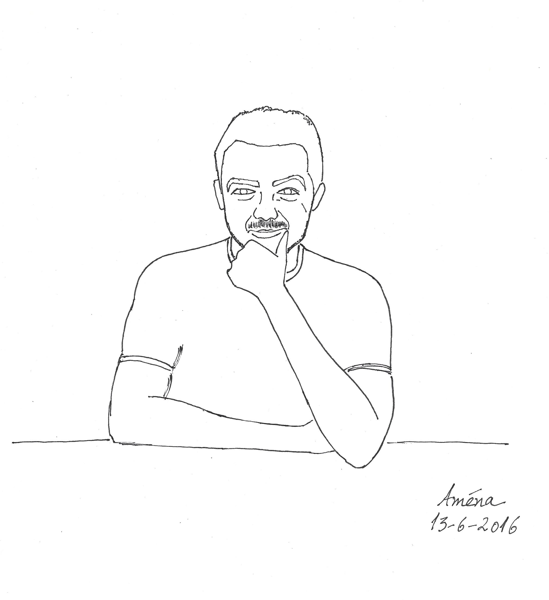

	
	

		Universidade Federal do Ceará - Campus Quixadá 
		Av. José de Freitas Queiroz, 5003 
		Cedro - Quixadá - Ceará 
		63902-580 
		Email: gomes dot atilio at ufc dot br
	

	<!-- 

	<h3>Reflexões em tempos de Covid-19</h3>
	<ul>
		<li>Vídeo: <a href="https://www.youtube.com/watch?v=tCPRFSZFFBQ" target="_blank">Tudo vai voltar ao normal</a></li>
		<li><a href="https://www.chronicle.com/article/Why-You-Should-Ignore-All-That/248366" target="_blank">Why You Should Ignore All That Coronavirus-Inspired Productivity Pressure</a></li>
		<li><a href="https://www.deviante.com.br/noticias/uma-ode-a-ciencia-a-multidisciplinaridade-no-combate-ao-coronavirus/" target="_blank">Uma Ode à Ciência: a multidisciplinaridade no combate ao Coronavírus</a></li>
		<li><a href="https://portalsbn.org/portal/tristes-reflexoes-em-tempos-do-covid-19/" target="_blank">Tristes reflexões em tempos de Covid 19</a></li>
	</ul> -->
	

	<h2>Education</h2>
        <ul>
	<li>Technical degree in Software Development from Instituto Federal de Educação, Ciência e Tecnologia do Ceará - <a href="https://ifce.edu.br/fortaleza" title="IFCE" target="_blank">IFCE Campus Fortaleza</a></li>
	<li>Bachelor's degree in Computing from Federal University of Ceara, Fortaleza - <a href="http://www.ufc.br" title="UFC" target="_blank">UFC</a></li>
        <li>Master's degree in Computer Science from University of Campinas - <a href="http://www.unicamp.br/" title="UNICAMP" target="_blank">UNICAMP</a> with collaborative period at <a href="https://uwaterloo.ca/" title="UW" target="_blank">University of Waterloo</a></li>
        <li>PhD in Computer Science from University of Campinas (UNICAMP) with collaborative period at University of Waterloo.</li>
	</ul>
	

	<h2>Research Interests</h2>			
            <ul>
            <li>Graph Theory</li>
            <li>Discrete Mathematics</li>
            <li>Design and Analysis of Algorithms</li>
	    </ul>
	

        <h2>Links</h2>			
            <ul>
		    <li><a href="https://scholar.google.com.br/citations?user=SoW-AFAAAAAJ&hl=pt-BR&oi=ao&hl=pt-BR" title="Google Scholar" target="_blank">Google Scholar</a></li>
            <li><a href="http://lattes.cnpq.br/7364915463901013" title="CV Lattes" target="_blank">CV Lattes</a></li>
            <li><a href="https://orcid.org/0000-0002-6177-403X" title="ORCID" target="_blank">ORCID</a></li>
		    <li><a href="https://dblp.uni-trier.de/pers/hd/l/Luiz:At=iacute=lio_G=" title="dblp" target="_blank">DBLP</a></li>
		    <li><a href="https://www.researchgate.net/profile/Atilio-Luiz" title="research gate" target="_blank">Research Gate</a></li>	    
		    <li><a href="https://www.mathgenealogy.org/id.php?id=257300" title="MGP" target="_blank">Mathematics Genealogy Project</a></li>
		    <li>My Master's dissertation (2014): Adjacent-vertex-distinguishing total colorings of graphs <a href="http://www.repositorio.unicamp.br/acervo/detalhe/932506?guid=1639139978235&returnUrl=%2fresultado%2flistar%3fguid%3d1639139978235%26quantidadePaginas%3d1%26codigoRegistro%3d932506%23932506&i=6" title="my dissertation" target="_blank">(link)</a></li>
		    <li>My PhD Thesis (2018): Graceful labellings and neighbour-distinguishing labellings of graphs <a href="http://www.repositorio.unicamp.br/acervo/detalhe/1031418?guid=1639139978235&returnUrl=%2fresultado%2flistar%3fguid%3d1639139978235%26quantidadePaginas%3d1%26codigoRegistro%3d1031418%231031418&i=3" title="my PhD thesis" target="_blank">(link)</a></li>
		    <!--<li>Some interesting mathematical problems and structures:</li>
		    <ul>
		    <li><a href="https://www.youtube.com/watch?v=v5KWzOOhZrw" target="_blank">Graceful tree problem</a></li>
		    <li><a href="https://www.youtube.com/watch?v=niaeV_NHh-o" target="_blank">Hadwiger–Nelson problem</a></li>
			    <li><a href="slides-aula01-MO804.pdf" target="_blank">Magic graphs</a></li>	
			    <li><a href="https://www.youtube.com/watch?v=C4Zr4cOVm9g" target="_blank">Perfect graphs</a></li>
		    </ul>-->
	    </ul>
	

 	<h2>Presentations</h2>			
            <ul>
	    <li><a href="slides-pgmat.pdf" title="" target="_blank">Rotulações de grafos com restrições nas distâncias</a></li>
            <li><a href="slides-lawcg24.pdf" title="" target="_blank">Double Roman Domination on graphs with maximum degree 3</a></li>
	    </ul>
	
 
	  
	<a href="https://youtu.be/4R_boNXPygs" target="_blank">Precisamos de você</a> 
	<a href="https://youtu.be/TRPBY_lxJfE?si=x9vVF_4l-gk6LRhK" target="_blank">Você tem brio?</a>

